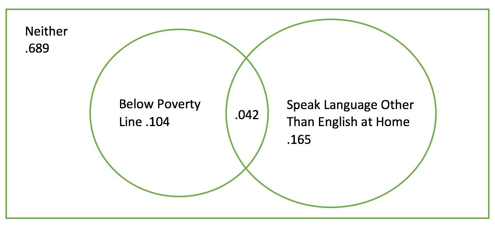
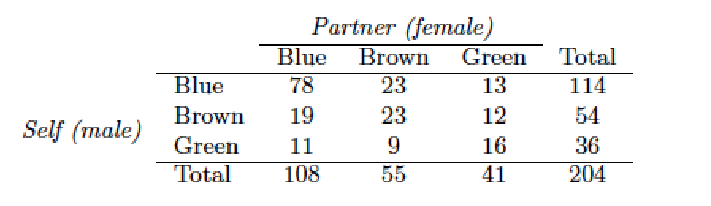
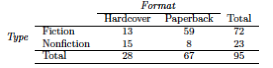

```{r setup, include=FALSE}
knitr::opts_chunk$set(echo = TRUE)
```

## Graded
#### 2.6 Dice rolls 
If you roll a pair of fair dice, what is the probability of

(a) getting a sum of 1?
(b) getting a sum of 5?
(c) getting a sum of 12?

```{r, comment=NA}
# a) 
0
# b) 
1/9
# c) 
1/36
```

#### 2.8 Poverty and language
The American Community Survey is an ongoing survey that provides data every year to give communities the current information they need to plan investments and services. The 2010 American Community Survey estimates that 14.6% of Americans live below the poverty line, 20.7% speak a language other than English (foreign language) at home, and 4.2% fall into both categories.

(a) Are living below the poverty line and speaking a foreign language at home disjoint? __No, these are not mutually exclusive events.__
(b) Draw a Venn diagram summarizing the variables and their associated probabilities.  __See embedded figure below.__
(c) What percent of Americans live below the poverty line and only speak English at home? __4.2%__
(d) What percent of Americans live below the poverty line or speak a foreign language at home? __14.6 + 20.7 - 4.2 = 31.1%__
(e) What percent of Americans live above the poverty line and only speak English at home?  __14.6 - 4.2 = 10.4%__
(f) Is the event that someone lives below the poverty line independent of the event that the person speaks a foreign language at home? __.146 * .207 != .042, so the events are dependant.__




#### 2.20  Assortative mating
Assortative mating is a nonrandom mating pattern where individuals with similar genotypes and/or phenotypes mate with one another more frequently than what would be expected under a random mating pattern. Researchers studying this topic collected data on eye colors of 204 Scandinavian men and their female partners. The table below summarizes the results. For simplicity, we only include heterosexual relationships in this exercise. 



(a) What is the probability that a randomly chosen male respondent or his partner has blue eyes? __108/204 + 114/204 - 78/204__
(b) What is the probability that a randomly chosen male respondent with blue eyes has a partner with blue eyes? __78/114__
(c) What is the probability that a randomly chosen male respondent with brown eyes has a partner with blue eyes? __19/54__ What about the probability of a randomly chosen male respondent with green eyes having a partner with blue eyes? __11/36__
(d) Does it appear that the eye colors of male respondents and their partners are independent? Explain your reasoning. __P(BlueM and BlueF)=78/204; P(BlueM) * P(BlueF) != P(BlueM and BlueF), so we can conclude that the events are not independant.__

#### 2.30 Books on a bookshelf
The table below shows the distribution of books on a bookcase based on whether they are nonfiction or fiction and hardcover or paperback.



(a) Find the probability of drawing a hardcover book first then a paperback fiction book second when drawing without replacement. 
(b) Determine the probability of drawing a fiction book first and then a hardcover book second, when drawing without replacement.
(c) Calculate the probability of the scenario in part (b), except this time complete the calculations under the scenario where the first book is placed back on the bookcase before randomly drawing the second book.
(d) The final answers to parts (b) and (c) are very similar. Explain why this is the case.

```{r, comment=NA}
# a)
round(28/95 * 59/94, 3)
# b)
round(59/95 * 28/94, 3) + round(13/95 * 27/94, 3)
# c) Since replacement, we no longer need to worry about whether the fiction
# book drawn first is hardcover or paperback. 
round(72/95 * 28/95, 3)
# d)
# The law of large numbers helps us here.   When we're sampling without
# replacement we're really only dealing with the different between 94 and 
# 95 total samples.   Thus, the difference between is negligible.  
```

#### 2.38 Baggage fees
An airline charges the following baggage fees: $25 for the first bag and $35 for the second. Suppose 54% of passengers have no checked luggage, 34% have one piece of checked luggage and 12% have two pieces. We suppose a negligible portion of people check more than two bags.

(a) Build a probability model, compute the average revenue per passenger, and compute the corresponding standard deviation.
(b) About how much revenue should the airline expect for a flight of 120 passengers? With what standard deviation? Note any assumptions you make and if you think they are justified.

```{r, comment=NA}
# a) 
value <- c(0, 25, 25+35)
probs <- c(.54, .34, .12)
EX <- sum(value * probs)
# the expected value or avg revenue per passenger: 
EX

sigma <- round(sqrt(sum((value-EX)^2 * probs)), 3)
# the standard deviation: 
sigma

# b)
# expected revenue for 120 passengers: 
EX * 120
# expected SD for 120 passengers:
round(sqrt(120*sigma^2), 3)

# We assume this is a discrete random variable, since there are a finite 
# number of seats available on any given flight.   
```

#### 2.44 Income and gender
The relative frequency table below displays the distribution of annual total personal income (in 2009 inflation-adjusted dollars) for a representative sample of 96,420,486 Americans. These data come from the American Community Survey for 2005-2009. This sample is comprised of 59% males and 41% females.

```{r, comments=NA}
Income <- c("$1 to $9,999", "$10,000 to $14,999", "$15,000 to $24,999",
            "$25,000 to $34,999", "$35,000 to $49,999", 
            "$50,000 to $64,999", "$65,000 to $74,999",
            "$75,000 to $99,999", "$100,000 or more")
Total <- c(.022, .047, .158, .183, .212, .139, .058, .084, .097)
df <- data.frame(Income, Total)
df
```

(a) Describe the distribution of total personal income.
(b) What is the probability that a randomly chosen US resident makes less than $50,000 per year?
(c) What is the probability that a randomly chosen US resident makes less than $50,000 per year and is female? Note any assumptions you make.
(d) The same data source indicates that 71.8% of females make less than $50,000 per year. Use this value to determine whether or not the assumption you made in part (c) is valid.

```{r, comments=NA}
barplot(df$Total, main="Distribution of Personal Income, ACS Sample, 2005-2009")
summary(df$Total)

# a)  We can see that this distribution appears to be unimodal 
# with a clear peak around $3.5-4.9k.   It appears to be skewed 
# slightly right. 
# b)  
sum(df$Total[1:5])
# c) Assuming these are independant events:  
round(sum(df$Total[1:5]) * .41, 3)
# d) The data source indicates that .718 of females make < $50k.   Our 
# initial assumption was that salary and gender were independant. 
# There is nearly a 10% difference (.718 - .622) between the observations, 
# so we should rightly conclude that salary and gender are not independant. 
```


