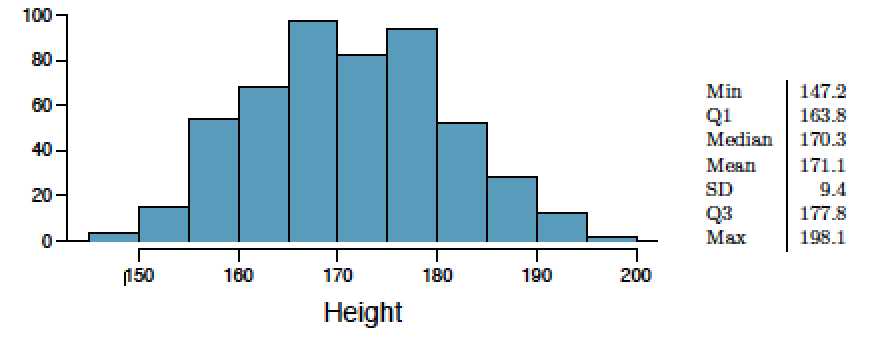
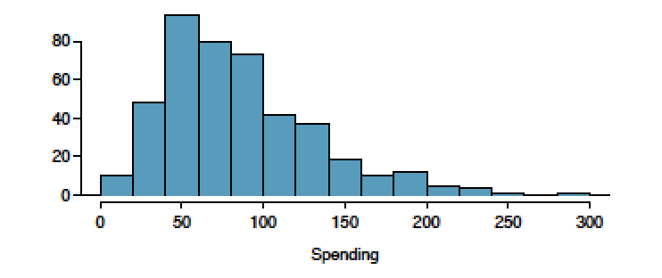
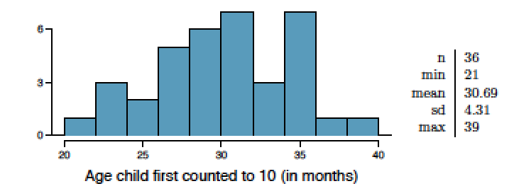
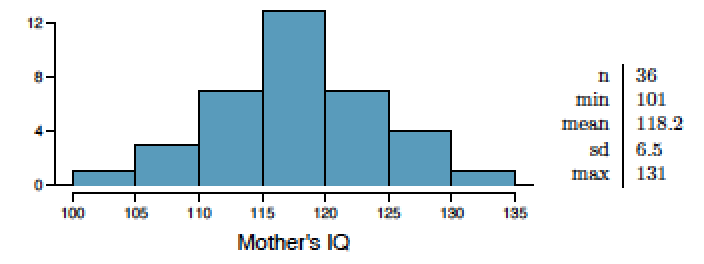

```{r setup, include=FALSE}
knitr::opts_chunk$set(echo = TRUE)
library(IS606)
library(ggplot2)
```

# Graded

##4.4 Heights of adults. 

Researchers studying anthropometry collected body girth measurements
and skeletal diameter measurements, as well as age, weight, height and gender, for 507 physically active individuals. The histogram below shows the sample distribution of heights in centimeters.



(a) What is the point estimate for the average height of active individuals? What about the median? __PE Mean = 171.1; PE Median = 170.3__
(b) What is the point estimate for the standard deviation of the heights of active individuals? What about the IQR? __PE SD = 9.4; PE IQR = Q3 - Q1 = `r 177.8 - 163.8`__
(c) Is a person who is 1m 80cm (180 cm) tall considered unusually tall? And is a person who is 1m 55cm (155cm) considered unusually short? Explain your reasoning. __180 cm is not unusually tall.  Based on the PE mean and the appearance that the data is relatively normally distributed, 180cm is ~ 1 PE standard deviation above the mean.  Similarly, 155 cm is ~1.5 PE SD below the mean.   It is slightly more unusual for a person in this distribution to be this short, but I would hesitate to call them unusually short.__
(d) The researchers take another random sample of physically active individuals. Would you expect the mean and the standard deviation of this new sample to be the ones given above? Explain your reasoning. __We would expect the point estimates for the new sample to be similar, but not the same.  It would be difficult to attain these exact same point estimates from a random sample, but we would expect them to be relatively close.__
(e) The sample means obtained are point estimates for the mean height of all active individuals, if the sample of individuals is equivalent to a simple random sample. What measure do we use to quantify the variability of such an estimate (Hint: recall that $$SD_x = \frac{\sigma}{\sqrt{n}}$$ )? Compute this quantity using the data from the original sample under the condition that the data are a simple random sample. __We compute the standard error of the sample mean to be `r round(9.4/sqrt(507), 4)`.__

##4.14 Thanksgiving spending, Part I. 

The 2009 holiday retail season, which kicked off on November 27, 2009 (the day after Thanksgiving), had been marked by somewhat lower self-reported consumer spending than was seen during the comparable period in 2008. To get an estimate of consumer spending, 436 randomly sampled American adults were surveyed. Daily consumer spending for the six-day period after Thanksgiving, spanning the Black Friday weekend and Cyber Monday, averaged $84.71. A 95% confidence interval based on this sample is ($80.31, $89.11).

Determine whether the following statements are true or false, and explain your reasoning.



(a) We are 95% confident that the average spending of these 436 American adults is between $80.31 and $89.11. __False - The point estimate is always in the confidence interval.__
(b) This confidence interval is not valid since the distribution of spending in the sample is right skewed.  __False - The data is skewed, but not strongly skewed.__
(c) 95% of random samples have a sample mean between $80.31 and $89.11.  __False.   Our confidence interval is concerned with the population mean, no the sample mean.__
(d) We are 95% confident that the average spending of all American adults is between $80.31 and $89.11. __True - this is a proper use of the confidence interval.__
(e) A 90% confidence interval would be narrower than the 95% confidence interval since we don’t need to be as sure about our estimate. __True.  Fishing with a smaller net.__
(f) In order to decrease the margin of error of a 95% confidence interval to a third of what it is now, we would need to use a sample 3 times larger. __False - in odrder to decrese the margin of error to 1/3 of it's current value, we would need to take 9 times the current sample size.__
(g) The margin of error is 4.4. __True.   If we take half the confidence interval, we get this value.__

##4.24 Gifted children, Part I. 

Researchers investigating characteristics of gifted children collected data from schools in a large city on a random sample of thirty-six children who were identified as gifted children soon after they reached the age of four. The following histogram shows the distribution of the ages (in months) at which these children first counted to 10 successfully. Also provided are some sample statistics.



(a) Are conditions for inference satisfied? __Yes.   The sample is random and sufficiently large, and the population distribution is not strongly skewed.__
(b) Suppose you read online that children first count to 10 successfully when they are 32 months old, on average. Perform a hypothesis test to evaluate if these data provide convincing evidence that the average age at which gifted children first count to 10 successfully is less than the general average of 32 months. Use a significance level of 0.10.
$$H_0: \mu = 32$$ 
$$H_A: \mu < 32$$
$$\alpha = .10$$

```{r, comment=NA}
n <- 36
xbar <- 30.69
sd <- 4.31
se <- sd / sqrt(n)
z <- (xbar - 32) / se
p <- round(pnorm(-abs(z)), 4)
normalPlot(bounds = c(-Inf, z))
```

(c) Interpret the p-value in context of the hypothesis test and the data.
__Our p value is `r p`.   When compared to our alpha of 0.1, we reject the null hypothesis and conclude that there is sufficient effidence to support the claim that gifted children learn to count to 10 before the general population average.__
(d) Calculate a 90% confidence interval for the average age at which gifted children first count to 10 successfully.
```{r}
z90 <- 1.645
```
__The 90% confidence interval for when gifted children count to 10 is `r round(xbar - z90 * se, 3)`, `r round(xbar + z90 * se, 3)`.__

(e) Do your results from the hypothesis test and the confidence interval agree? Explain.
__The results do agree, as we are concerned with whether the children learn earlier than the average of 32 months.   Since the range of the confidence interval is less than 32, our test are in agreement.__

##4.26 Gifted children, Part II. 

Exercise 4.24 describes a study on gifted children. In this study, along with variables on the children, the researchers also collected data on the mother’s and father’s IQ of the 36 randomly sampled gifted children. The histogram below shows the distribution of mother’s IQ. Also provided are some sample statistics.



(a) Perform a hypothesis test to evaluate if these data provide convincing evidence that the average IQ of mothers of gifted children is different than the average IQ for the population at large, which is 100. Use a significance level of 0.10.

$$H_0: \mu = 100$$ 
$$H_A: \mu \neq 100$$
$$\alpha = .10$$

```{r}
xbar <- 118.2
n <- 36
sd <- 6.5
se <- sd / sqrt(n)
z <- (xbar - 100) / se
p <- 2 * (1-round(pnorm(z), 4))
```

__We definitely reject the null hypothesis and conclude that the average IQ of mothers of gifted children is different than the average IQ for the population at large.   Our Z value in this two-sided test ended up being 16.8, a massive value.  When we look at the min of the sample distribution of the mother's IQs, we see that it is above the value we are testing (100), helping explain this Z.__

(b) Calculate a 90% confidence interval for the average IQ of mothers of gifted children.
__The 90% confidence interval for the average IQ of mothers of gifted children is `r round(xbar - z90 * se, 3)`, `r round(xbar + z90 * se, 3)`.__

(c) Do your results from the hypothesis test and the confidence interval agree? Explain.
__They do.   In the p test we get a value well under our alpha, causing us to reject the null hypothesis.   In the 90% confidence test we get an interval also nowhere near the null hypothesis value, causing us to reject and accept the alternative hypothesis.__

##4.34 CLT. 

Define the term “sampling distribution” of the mean, and describe how the shape, center, and spread of the sampling distribution of the mean change as sample size increases.  __A sampling distribution shows the distribution of n samples from a population.  As the sample size n increases, the shape of the sample distribution approaches the normal distribution, the center becomes more pronounced (indicating a greater quantity of samples closer to the population mean), and the spread becomes narrower as larger amount of the samples congregate around the mean.__

##4.40 CFLBs. 

A manufacturer of compact fluorescent light bulbs advertises that the distribution of the lifespans of these light bulbs is nearly normal with a mean of 9,000 hours and a standard deviation of 1,000 hours.

(a) What is the probability that a randomly chosen light bulb lasts more than 10,500 hours?
```{r}
mean <- 9000
sd <- 1000
z <- (10500 - mean) / sd
p <- round(1 - pnorm(z), 4)
normalPlot(bounds = c(z, Inf))
```

(b) Describe the distribution of the mean lifespan of 15 light bulbs.
```{r}
se <- round(sd / sqrt(15))
```
__The distribution will be relatively normal with a standard error of `r se` and a point estimate near the population mean.__

(c) What is the probability that the mean lifespan of 15 randomly chosen light bulbs is more than 10,500 hours?
```{r}
z <- round((10500 - 9000)/se, 2)
```
__Our z score (`r z`) is very high.   It is highly improbable that the mean lifespan of a sample distribution of 15 randomly chosen bulbs would be > 10500.__

(d) Sketch the two distributions (population and sampling) on the same scale. __Note: Uses a solution for plotting multiple distributions recommended in a stackoverflow response, ref: [http://stackoverflow.com/questions/6939136/how-to-overlay-density-plots-in-r](http://stackoverflow.com/questions/6939136/how-to-overlay-density-plots-in-r).__
```{r}
set.seed(15)
dat <- data.frame(population=rnorm(15, mean, sd),
                  sampling=rnorm(15, mean, se))
dens <- apply(dat, 2, density)
plot(NA, xlim=range(sapply(dens, "[", "x")), ylim=range(sapply(dens, "[", "y")))
mapply(lines, dens, col=1:length(dens))
legend("topright", legend=names(dens), fill=1:length(dens))
```

(e) Could you estimate the probabilities from parts (a) and (c) if the lifespans of light bulbs had a skewed distribution?
__No, estimates require a distribution with relatively little skew.__

##4.48  Same observation, different sample size. 

Suppose you conduct a hypothesis test based on a sample where the sample size is n = 50, and arrive at a p-value of 0.08. You then refer back to your notes and discover that you made a careless mistake, the sample size should have been n = 500. Will your p-value increase, decrease, or stay the same? Explain.

__Since the sample size increases, this means the initial error was made in calculating the SE, compromising the integrity of the z score and p-value.  This new larger sample will cause the SE to decrease in size, the z score to increase, and the probability/p-value to decrease based on the new, higher z.  If you were unable to reject the null hypothesis with a p-value of 0.08, you may be able to with the new p-value.__
