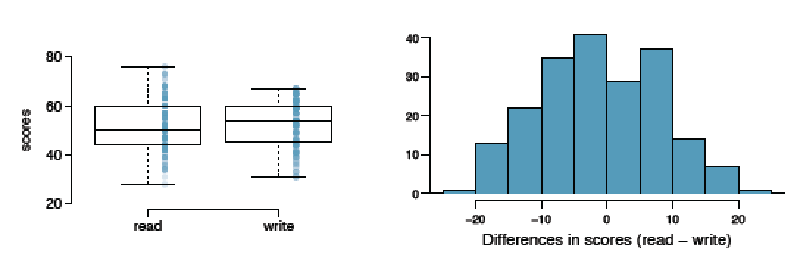
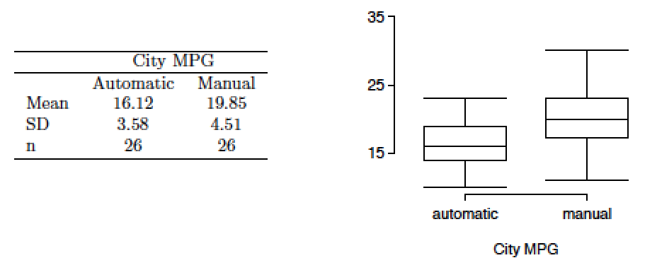
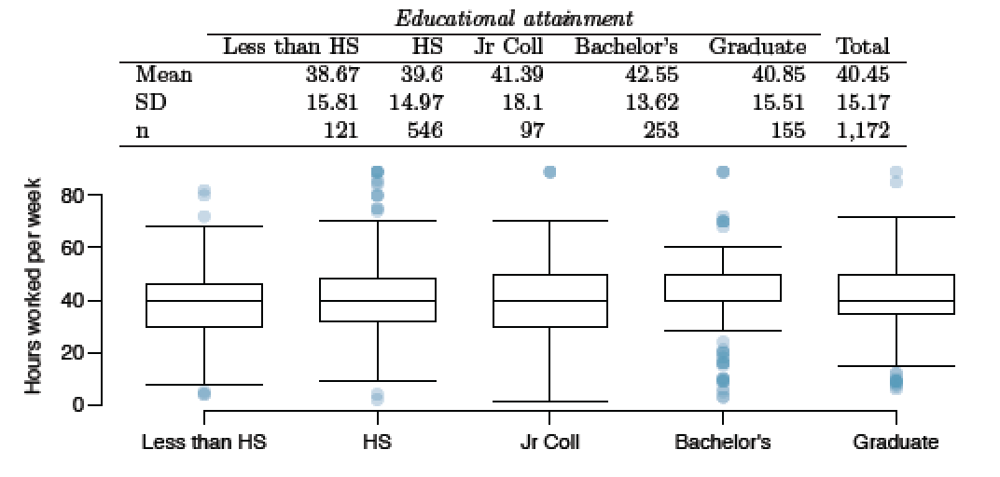

```{r setup, include=FALSE}
knitr::opts_chunk$set(echo = TRUE)
if (!require('IS606')) install.packages('IS606')
if (!require('ggplot2')) install.packages('ggplot2')
```

# Graded

Practice: 5.5, 5.13, 5.19, 5.31, 5.45

## 5.6 Working backwards, Part II

A 90% confidence interval for a population mean is (65, 77). The population distribution is approximately normal and the population standard deviation is unknown. This confidence interval is based on a simple random sample of 25 observations.  Calculate the sample mean, the margin of error, and the sample standard deviation.

```{r}
sampmean <- (77+65)/2
tdf <- round(qt(c(.05, .95), df=24)[2], 3)
SE <- round((77-sampmean)/tdf, 3)
sd <- SE * sqrt(25)
```

__Our $\bar{x}$ is `r sampmean`, the SE is `r SE` and the sample SD is roughly `r sd`. __

## 5.14 SAT scores

SAT scores of students at an Ivy League college are distributed with a standard deviation of 250 points. Two statistics students, Raina and Luke, want to estimate the average SAT score of students at this college as part of a class project. They want their margin of
error to be no more than 25 points.

25 = $z * \frac{250}{\sqrt{n}}$

or simplified

$n = (10 * z)^2$

(a) Raina wants to use a 90% confidence interval. How large a sample should she collect?

__It would be good to use $t_{df}$ instead of z, but since the sample size is in flux, we can't easily determine the df and use the t distribution.  For safety, let's instead use the z score for the requested confidence interval.__

```{r}
# let's build a function to calculate using z scores
ztest <- function(z) {
    round((10 * z)^2, 0)
}

# estimate 90% using z
z90 <- 1.65
ztest(z90)
```

(b) Luke wants to use a 99% confidence interval. Without calculating the actual sample size, determine whether his sample should be larger or smaller than Raina’s, and explain your reasoning.

__Since we want need to be more confident, the required sample size will increase.__

(c) Calculate the minimum required sample size for Luke.

```{r}
z99 <- 2.58
ztest(z99)
```

## 5.20  High School and Beyond, Part I

The National Center of Education Statistics conducted a survey of high school seniors, collecting test data on reading, writing, and several other subjects. Here we examine a simple random sample of 200 students from this survey. Side-by-side box plots of reading and writing scores as well as a histogram of the differences in scores are shown below.



(a) Is there a clear difference in the average reading and writing scores?

__Not obviously.  The means seem slighly different, but the distribution of differences looks quote normal.__

(b) Are the reading and writing scores of each student independent of each other?

__No.   The scores of either reading or writing are independant, but one student is likely to have scores for both sides in the sample.   The data appear to be paired.__ 

(c) Create hypotheses appropriate for the following research question: is there an evident difference in the average scores of students in the reading and writing exam?

__$H_O$: $\mu_r - \mu_w = 0$, No difference between the average reading and writing scores.__

__$H_A$: $\mu_r - \mu_w \neq 0$, There is a difference.__

(d) Check the conditions required to complete this test.

__We are told that the 200 students in the sample were randomly collected.   The box plots indicate a little enough skew that we can use the t distribution.   Conditions are satisfied.__

(e) The average observed difference in scores is $\bar{x}_{read-write}$ = -0.545, and the standard deviation of the differences is 8.887 points. Do these data provide convincing evidence of a difference
between the average scores on the two exams?

```{r}
SE <- round(8.887 / sqrt(200), 3)
t <- round((-0.545-0)/SE, 3)
p <- round(2 * pt(t, 199), 3)
```

__Our calculated p score is `r p`, which causes us to reject $H_A$.  There is not convincing evidence of a difference between the average means.__

(f) What type of error might we have made? Explain what the error means in the context of the application.

__Since we have rejected $H_A$, if it were actually true, we would have made a type II error.  That means that although we chose to accept $H_0$, there actually is convincing evidence of a difference in means. If we took a larger sample, we would decrease our chances of making a type II error.__

(g) Based on the results of this hypothesis test, would you expect a confidence interval for the average difference between the reading and writing scores to include 0? Explain your reasoning.

__We would expect confidence intervals to include 0, as it has been determined that there is no convincing evidence of a difference in average means.__

## 5.32 Fuel efficiency of manual and automatic cars, Part I

Each year the US Environmental Protection Agency (EPA) releases fuel economy data on cars manufactured in that year. Below are summary statistics on fuel efficiency (in miles/gallon) from random samples of cars with manual and automatic transmissions manufactured in 2012. Do these data provide strong evidence of a difference between the average fuel efficiency of cars with manual and automatic transmissions in terms of their average city mileage? Assume that conditions for inference are satisfied.



__$H_O$: $\mu_a - \mu_m = 0$, No difference between the average automatic and manual MPG.__

__$H_A$: $\mu_a - \mu_m \neq 0$, There is a difference.__

__$\sigma = .05$__

```{r}
n <- 26
mdiff <- 16.12 - 19.85
sddiff <- 3.58 - 4.51
SEdiff <- sqrt((3.58^2)/n + (4.51^2)/n)
t <- (mdiff-0)/SEdiff
p <- round(2 * pt(t, n-1), 3)
p
```

__With $\sigma = .05$ and p = `r p`, we reject $H_0$.   There is convincing evidence of a difference in the means of miles per gallon in manual and automatic transmissions.__

## 5.48 Work hours and education

The General Social Survey collects data on demographics, education, and work, among many other characteristics of US residents.  Using ANOVA, we can consider educational attainment levels for all 1,172 respondents at once. Below are the distributions of hours worked by educational attainment and relevant summary statistics that will be helpful in carrying out this analysis.



(a) Write hypotheses for evaluating whether the average number of hours worked varies across the five groups.

__$H_0: \mu_{<HS} = \mu_{HS} = \mu_{JR} = \mu_{B} = \mu_{G}$.  The avg hours worked arcross all five groups does not vary.__

__$H_A:$ The avg hours across some or all groups does vary.__

(b) Check conditions and describe any assumptions you must make to proceed with the test.

__The data in each group appears relatively normal and the variability is similar across each group.   In order to perform an ANOVA test, we are assuming that the observations are independant.__

(c) Below is part of the output associated with this test. Fill in the empty cells.

```{r}
k <- 5
df_G <- k-1
n <- 1172
df_E <- n - k
df_T <- df_G + df_E
gmean <- 40.45
SSW <- round(sum((121-1)*15.81^2, (546-1)*14.97^2, (97-1)*18.1^2,
           (253-1)*13.62^2, (155-1)*15.51^2), 0)
SSB <- round(sum(121*(38.67-gmean)^2, 546*(39.6-gmean)^2, 97*(41.39-gmean)^2, 
           253*(42.55-gmean)^2, 155*(40.85-gmean)^2), 0)
SST <- round(SSW + SSB, 0)
MSB <- round(SSB / (k-1), 2)
MSW <- round(SSW / (n-k), 2)
f <- round(MSB / MSW, 3)
```


ANOVA     | Df     | Sum Sq          | Mean Sq  | F value     | Pr(>F)   | 
----------|--------|-----------------|----------|-------------|----------|
degree    |`r df_G`|`r SSB`          | 501.54   | `r f`       |  0.0682  |
Residuals |`r df_E`|  267382         | `r MSW ` |             |          |
Total     |`r df_T`|  269378         |          |             |          |

(d) What is the conclusion of the test?

__There is not enough evidence for us to reject $H_0$, thus we accept and conclude there is not convincing eveidence that the avg hours worked per week is any different for the 5 educational groups.__
