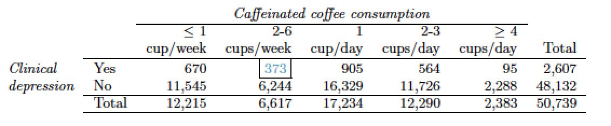

```{r setup, include=FALSE}
knitr::opts_chunk$set(echo = TRUE)
if (!require('IS606')) install.packages('IS606')
if (!require('ggplot2')) install.packages('ggplot2')
```

Practice: 6.5, 6.11, 6.27, 6.43, 6.47

# Graded

## 6.6 2010 Healthcare Law. 

On June 28, 2012 the U.S. Supreme Court upheld the much debated 2010 healthcare law, declaring it constitutional. A Gallup poll released the day after this decision indicates that 46% of 1,012 Americans agree with this decision. At a 95% confidence level, this sample has a 3% margin of error. Based on this information, determine if the following statements are true or false, and explain your reasoning.

```{r}
p <- .46
n <- 1012
se <- round(sqrt((p*(1-p))/n), 3)
z <- 1.96
me <- round(z * se, 3)
p - me; p + me
```

(a) We are 95% confident that between 43% and 49% of Americans in this sample support the decision of the U.S. Supreme Court on the 2010 healthcare law.
__False. The confidence interval is not concerned with the sample.   It is concerned with the population.__

(b) We are 95% confident that between 43% and 49% of Americans support the decision of the U.S. Supreme Court on the 2010 healthcare law.
__True.   We this is backed up by the calculations.__

(c) If we considered many random samples of 1,012 Americans, and we calculated the sample proportions of those who support the decision of the U.S. Supreme Court, 95% of those sample proportions will be between 43% and 49%.
__True.   This is also a good way of describing the convidence interval.__

(d) The margin of error at a 90% confidence level would be higher than 3%.
__False.   Since we are casting a more narrow net, our z goes down, as does our margin of error.__

## 6.12 Legalization of marijuana, Part I. 

The 2010 General Social Survey asked 1,259 US residents: “Do you think the use of marijuana should be made legal, or not?” 48% of the respondents said it should be made legal.

```{r}
p <- .48
n <- 1259
se <- round(sqrt((p*(1-p))/n), 3)
z <- 1.96
me <- round(z * se, 2)
p - me; p + me
```


(a) Is 48% a sample statistic or a population parameter? Explain.
__48% is a point estimate from the sample.   We can make inferrences about the population from it, it does not directly describe the population.__

(b) Construct a 95% confidence interval for the proportion of US residents who think marijuana should be made legal, and interpret it in the context of the data.
__We are 95% confident that the true proportion of US residents who thing that marijuana should be legal is between 45-51%.__

(c) A critic points out that this 95% confidence interval is only accurate if the statistic follows a normal distribution, or if the normal model is a good approximation. Is this true for these data? Explain.
__Since the data does not skew strongly to either side, our distribution of phat is nearly normal.   Our observations seem to be indpendant, and we definitely have a large sample of both success and failiure rates.__

(d) A news piece on this survey’s findings states, “Majority of Americans think marijuana should be legalized.” Based on your confidence interval, is this news piece’s statement justified? 
__It is not.   It is possible that 51% is the true proportion, but more of our confidence interval spans below 50%.__

## 6.20 Legalize Marijuana, Part II. 

As discussed in Exercise 6.12, the 2010 General Social Survey reported a sample where about 48% of US residents thought marijuana should be made legal. If we wanted to limit the margin of error of a 95% confidence interval to 2%, about how many Americans would we need to survey?

```{r}
p <- .48
z <- 1.96
me <- .02
se <- me/z
n <- round(p * (1-p) / se^2)
```

__We should survey `r n` Americans.__

## 6.28 Sleep deprivation, CA vs. OR, Part I. 

According to a report on sleep deprivation by the Centers for Disease Control and Prevention, the proportion of California residents who reported insufficient rest or sleep during each of the preceding 30 days is 8.0%, while this proportion is 8.8% for Oregon residents. These data are based on simple random samples of 11,545 Californiaand 4,691 Oregon residents. Calculate a 95% confidence interval for the difference between the proportions of Californians and Oregonians who are sleep deprived and interpret it in context of the data.

```{r}
nC <- 11545
nO <- 4691
pC <- .08
pO <- .088

## check conditions
pO * nO
pC * nC

## calc stats
diff <- pO - pC
se <- round(sqrt((pO*(1-pO))/nO + (pC*(1-pC))/nC), 6)
z <- 1.96
me <- round(se * z, 6)
diff - me; diff + me
```

__We are 95% confident that the difference in proportion of Oregonians who reported insufficient sleep to Californians is between -.149% (negative indicating that Californians reported more insufficient sleep) and 1.75%.__

## 6.44 Barking deer. 

Microhabitat factors associated with forage and bed sites of barking deer
in Hainan Island, China were examined from 2001 to 2002. In this region woods make up 4.8% of the land, cultivated grass plot makes up 14.7% and deciduous forests makes up 39.6%. Of the 426 sites where the deer forage, 4 were categorized as woods, 16 as cultivated grassplot, and 61 as deciduous forests. The table below summarizes these data. 

```{r}
t <- 426
woods <- c(4, round(t * .048))
grassplot <- c(16, round(t * .147))
forests <- c(67, round(t * .396))
other <- c(345, round(t * .409))
total <- c(t, t)
df <- data.frame(rbind(woods, grassplot, forests, other, total))
colnames(df) <- c("observed", "expected")
df$z2 <- (df$observed-df$expected)^2 / df$expected
x2 <- round(sum(df$z2), 2)
free <- 3
knitr::kable(df)
```

(a) Write the hypotheses for testing if barking deer prefer to forage in certain habitats over others.

__$H_O$: The deer foraging sites are a random sample.   They do not prefer certain habitats over others.__

__$H_A$: The deer foraging sites are not randomly sampled.   They do have a preference.__ 

(b) What type of test can we use to answer this research question?

__A Chi-square test will help us determine if the observed observation is a random sample.__

(c) Check if the assumptions and conditions required for this test are satisfied.

__We believe that the counts are independant.   While we have an observed value of 4 woods, we have an expected value of 20.__

(d) Do these data provide convincing evidence that barking deer prefer to forage in certain habitats over others? Conduct an appropriate hypothesis test to answer this research question.

__Our test statistic is extremely high $X^2$ = `r x2` with 3 degrees of freedom.  We take a cursory look and see that our p-value is terrifically low.   This gives us reason to reject $H_O$ and conclude that barking deer do in fact prefer to forage in certain habitats.__

## 6.48 Coffee and Depression

Researchers conducted a study investigating the relationship between caffeinated coffee consumption and risk of depression in women. They collected data on 50,739 women free of depression symptoms at the start of the study in the year 1996, and these women were followed through 2006. The researchers used questionnaires to collect data on caffeinated coffee consumption, asked each individual about physician-diagnosed depression, and also asked about the use of antidepressants. The table below shows the distribution of incidences of depression by amount of caffeinated coffee consumption.



(a) What type of test is appropriate for evaluating if there is an association between coffee intake and depression?
(b) Write the hypotheses for the test you identified in part (a).
(c) Calculate the overall proportion of women who do and do not suffer from depression.
(d) Identify the expected count for the highlighted cell, and calculate the contribution of this cell to the test statistic, i.e. (Observed - Expected)^2 / Expected
(e) The test statistic is X^2 = 20.93. What is the p-value?
(f) What is the conclusion of the hypothesis test?
(g) One of the authors of this study was quoted on the NYTimes as saying it was “too early to recommend that women load up on extra coffee” based on just this study.  Do you agree with this statement? Explain your reasoning.
