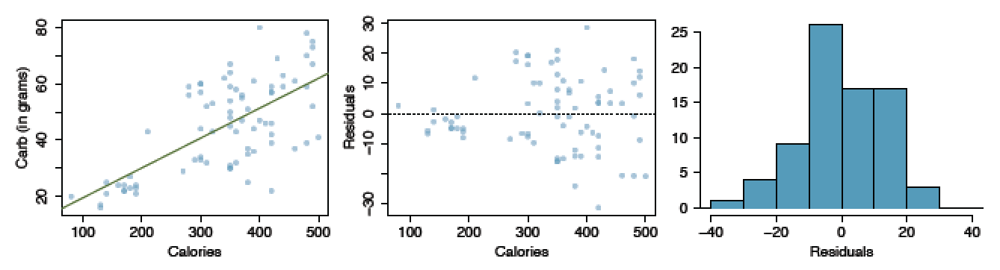
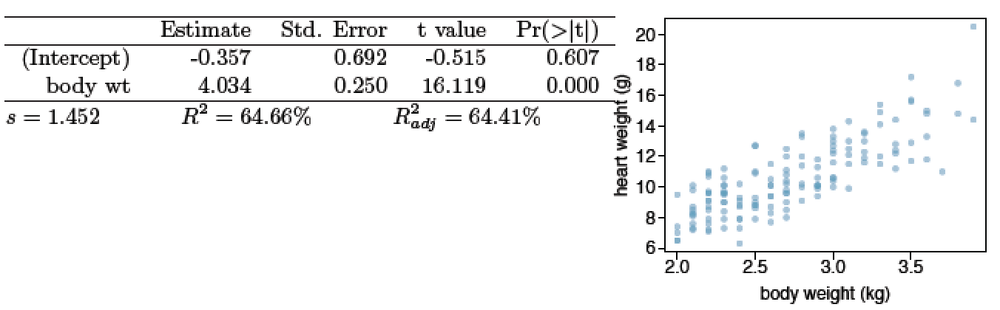
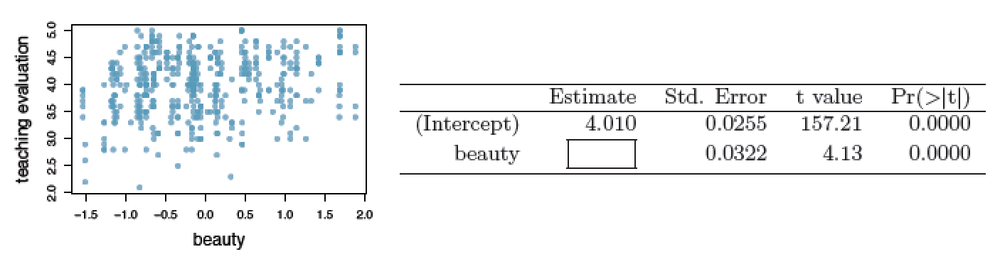
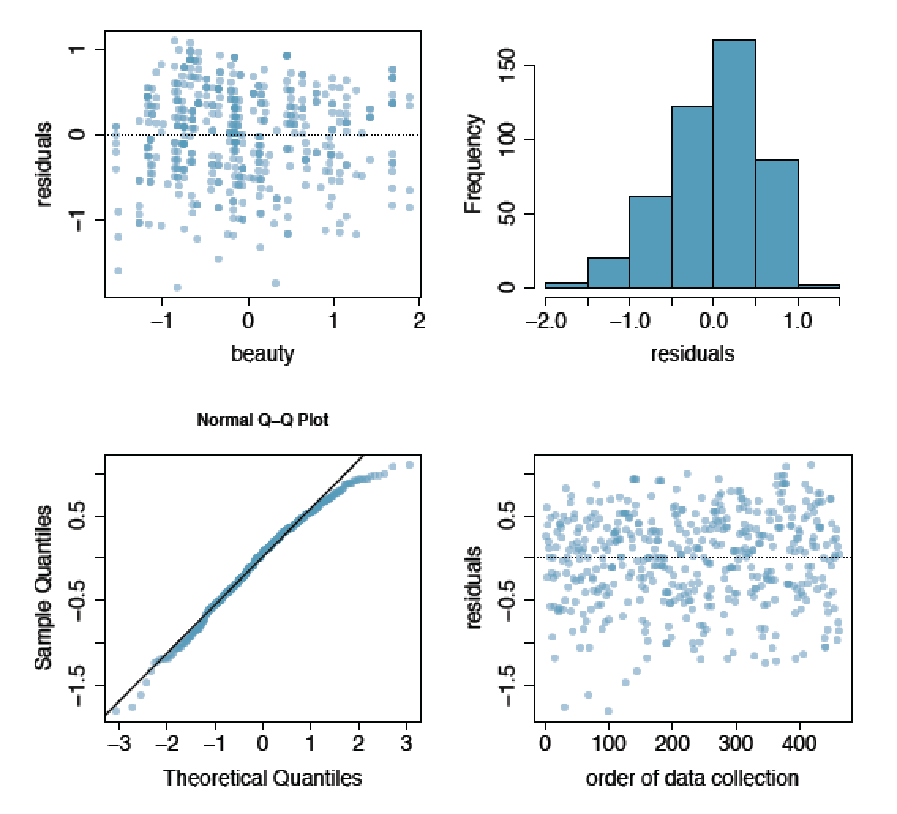

```{r setup, include=FALSE}
knitr::opts_chunk$set(echo = TRUE)
if (!require('IS606')) install.packages('IS606')
```

Practice: 7.23, 7.25, 7.29, 7.39

# Graded

## 7.24  Nutrition at Starbucks, Part I. 

The scatterplot below shows the relationship between the number of calories and amount of carbohydrates (in grams) Starbucks food menu items contain.  Since Starbucks only lists the number of calories on the display items, we are interested in predicting the amount of carbs a menu item has based on its calorie content.



(a) Describe the relationship between number of calories and amount of carbohydrates (in grams) that Starbucks food menu items contain.

__There is seems to be a positive correlation with a mild upward trend between calories and carbohydrates.__

(b) In this scenario, what are the explanatory and response variables?

__Explanatory = Calories; Response =  Carbs (in grams)__

(c) Why might we want to fit a regression line to these data?

__We might want to predict how many grams of carbs some food contains, given a certain calorie count.__

(d) Do these data meet the conditions required for fitting a least squares line?

__While the data fit a linear trend, and the residuals appear nearly normal, we may not meet the criteria for constant variablity.   We can see that as calories increase so to does the variability of carbs.__

## 7.26  Body measurements, Part III. 

Exercise 7.15 introduces data on shoulder girth and height of a group of individuals. The mean shoulder girth is 107.20 cm with a standard deviation
of 10.37 cm. The mean height is 171.14 cm with a standard deviation of 9.41 cm. The correlation between height and shoulder girth is 0.67.

(a) Write the equation of the regression line for predicting height.
(b) Interpret the slope and the intercept in this context.
(c) Calculate R2 of the regression line for predicting height from shoulder girth, and interpret it in the context of the application.
(d) A randomly selected student from your class has a shoulder girth of 100 cm. Predict the height of this student using the model.
(e) The student from part (d) is 160 cm tall. Calculate the residual, and explain what this residual means.
(f) A one year old has a shoulder girth of 56 cm. Would it be appropriate to use this linear model to predict the height of this child?

## 7.30  Cats, Part I. 

The following regression output is for predicting the heart weight (in g) of cats from their body weight (in kg). The coefficients are estimated using a dataset of 144 domestic cats.



(a) Write out the linear model.
(b) Interpret the intercept.
(c) Interpret the slope.
(d) Interpret R2.
(e) Calculate the correlation coefficient.

## 7.40  Rate my professor. 

Many college courses conclude by giving students the opportunity to evaluate the course and the instructor anonymously. However, the use of these student evaluations as an indicator of course quality and teaching effetiveness is often criticized because these measures may reflect the influence of non-teaching related characteristics, such as the physical appearance of the instructor. Researchers at University of Texas, Austin collected data on teaching evaluation score (higher score means better) and standardized beauty score (a score of 0 means average, negative score means below average, and a positive score means above average) for a sample of 463 professors.  The scatterplot below shows the relationship between these variables, and also provided is a regression output for predicting teaching evaluation score from beauty score.



(a)  Given that the average standardized beauty score is -0.0883 and average teaching evaluation score is 3.9983, calculate the slope. Alternatively, the slope may be computed using just the information provided in the model summary table.
(b)  Do these data provide convincing evidence that the slope of the relationship between teaching evaluation and beauty is positive? Explain your reasoning.
(c)  List the conditions required for linear regression and check if each one is satisfied for this model based on the following diagnostic plots.


