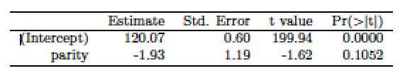
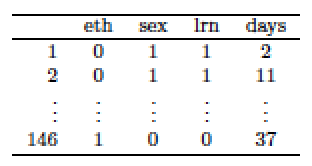
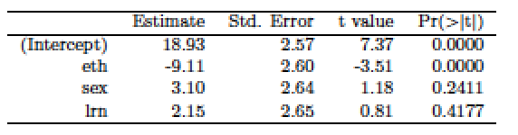
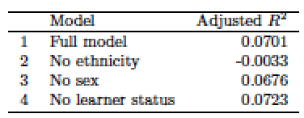
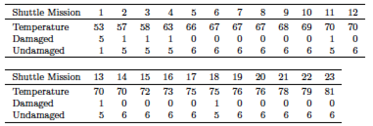
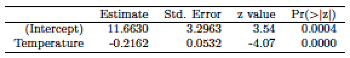
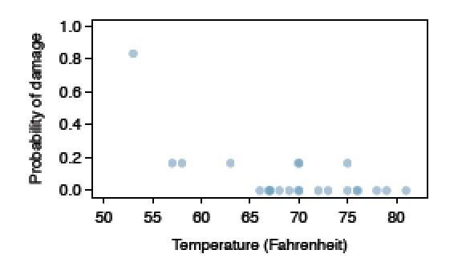
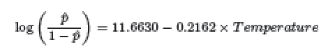
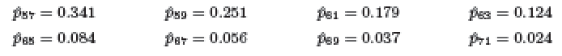

```{r setup, include=FALSE}
knitr::opts_chunk$set(echo = TRUE)
if (!require('IS606')) install.packages('IS606')
```


Practice: 8.1, 8.3, 8.7, 8.15, 8.17


# Graded

## 8.2 Baby weights, Part II. 

Exercise 8.1 introduces a data set on birth weight of babies. Another variable we consider is parity, which is 0 if the child is the first born, and 1 otherwise.  The summary table below shows the results of a linear regression model for predicting the average
birth weight of babies, measured in ounces, from parity.



(a) Write the equation of the regression line.

$\widehat{weight}$ = 120.07 + -1.93 * parity

(b) Interpret the slope in this context, and calculate the predicted birth weight of first borns and others.

__The avg birth weight of a first-born baby is 1.93 oz higher than those that are otherwise.__

(c) Is there a statistically significant relationship between the average birth weight and parity?

__Not really.   The p-value for parity is greater than .05.__  

## 8.4 Absenteeism. 

Researchers interested in the relationship between absenteeism from school and certain demographic characteristics of children collected data from 146 randomly sampled students in rural New SouthWales, Australia, in a particular school year. Below are three observations
from this data set.



The summary table below shows the results of a linear regression model for predicting the average number of days absent based on ethnic background (eth: 0 - aboriginal, 1 - not aboriginal), sex
(sex: 0 - female, 1 - male), and learner status (lrn: 0 - average learner, 1 - slow learner).



(a) Write the equation of the regression line.

$\widehat{daysabsent}$ = 18.93 + -9.11 * eth + 3.10 * sex + 2.15 * lrn

(b) Interpret each one of the slopes in this context.

__If the student is aboriginal, they are likely to have 9.11 more days absent.   If the student is male, they are likely to have 3.10 more days absent.   If the student is categorized as a slow learner, they are likely to have 2.15 more days absent.__

(c) Calculate the residual for the first observation in the data set: a student who is aboriginal, male, a slow learner, and missed 2 days of school.

```{r}
eth <- 0
sex <- 1
lrn <- 1
predicted <- 18.93 + -9.11 * eth + 3.10 * sex + 2.15 * lrn

residual <- 2 - predicted
residual
```

(d) The variance of the residuals is 240.57, and the variance of the number of absent days for all students in the data set is 264.17. Calculate the R2 and the adjusted R2. Note that there are 146 observations in the data set.

```{r}
R2 <- 1 - 240.57/264.17
adjR2 <- 1 - 240.57 / 264.17 * (146 - 1) / (146 - 3 - 1)
```

__The R2 is `r round(R2, 5)` and the Adjusted R2 is `r round(adjR2, 5)`__

## 8.8 Absenteeism, Part II. 

Exercise 8.4 considers a model that predicts the number of days absent using three predictors: ethnic background (eth), gender (sex), and learner status (lrn). The table below shows the adjusted R-squared for the model as well as adjusted R-squared values
for all models we evaluate in the first step of the backwards elimination process.



Which, if any, variable should be removed from the model first?

__We should probably keep all the variables, but if one needed to be removed we would start with the learner status.__

## 8.16 Challenger disaster, Part I. 

On January 28, 1986, a routine launch was anticipated for the Challenger space shuttle. Seventy-three seconds into the flight, disaster happened: the shuttle broke apart, killing all seven crew members on board. An investigation into the cause of the disaster focused on a critical seal called an O-ring, and it is believed that damage to these O-rings during a shuttle launch may be related to the ambient temperature during the launch. The table below summarizes observational data on O-rings for 23 shuttle missions, where the mission order is based on the temperature at the time of the launch. Temp gives the temperature in Fahrenheit, Damaged represents the number of damaged O-rings, and Undamaged represents the number of O-rings that were not damaged.



(a) Each column of the table above represents a different shuttle mission. Examine these data and describe what you observe with respect to the relationship between temperatures and damaged O-rings.

__There seems to be a relationship between lower temperatures at time of launch and damaged O-rings.  Based on the table, the lower the temperature, the higher the probability of a damaged O-ring.__

(b) Failures have been coded as 1 for a damaged O-ring and 0 for an undamaged O-ring, and a logistic regression model was fit to these data. A summary of this model is given below. Describe the key components of this summary table in words.



__The estimate coefficients and the p-values are the key components.  11.6630 is the starting place for the model and -0.2162 is added to the starting place for every degree of temperature.   The p-values help us better determine the variable fit in the model.__

(c) Write out the logistic model using the point estimates of the model parameters.

$\widehat{pFailure}$ = e^(11.6630-0.2162 * temp) / (1 + e^(11.6630-0.2162 * temp))

(d) Based on the model, do you think concerns regarding O-rings are justified? Explain.

__Yes, it does show that as the temperature drops, the probability of O-ring failure grows.   According to our model, if the temperature drops below 50, the probability of O-Ring failure exceeds 100%.__

## 8.18 Challenger disaster, Part II. 

Exercise 8.16 introduced us to O-rings that were identified as a plausible explanation for the breakup of the Challenger space shuttle 73 seconds into takeoff in 1986. The investigation found that the ambient temperature at the time of the shuttle launch was closely related to the damage of O-rings, which are a critical component of the shuttle. See this earlier exercise if you would like to browse the original data.



(a) The data provided in the previous exercise are shown in the plot. The logistic model fit to these data may be written as



where ˆp is the model-estimated probability that an O-ring will become damaged. Use the model to calculate the probability that an O-ring will become damaged at each of the following
ambient temperatures: 51, 53, and 55 degrees Fahrenheit. The model-estimated probabilities for several additional ambient temperatures are provided below, where subscripts indicate the
temperature:



```{r}
e <- exp(1)
temp <- c(51, 53, 55)
round(e^(11.6630-(0.2162 * temp)) / (1 + e^(11.6630-(0.2162 * temp))), 3)
```

(b) Add the model-estimated probabilities from part (a) on the plot, then connect these dots using a smooth curve to represent the model-estimated probabilities.

```{r}
temp <- c(50:85)
probs <- round(e^(11.6630-(0.2162 * temp)) / (1 + e^(11.6630-(0.2162 * temp))), 3)
plot(temp, probs, type = "l", main = "logistic model \n probability of O-ring failure by temp")
```

(c) Describe any concerns you may have regarding applying logistic regression in this application, and note any assumptions that are required to accept the model’s validity.

__My only real concern is with the major data point at 53 degrees, where 5 of 6 O-rings failed.  Much of the model hinges on this data point.   If that outlier turned out to be related to some factor other than the 53 degree temperature, much of the model would be compromised.__