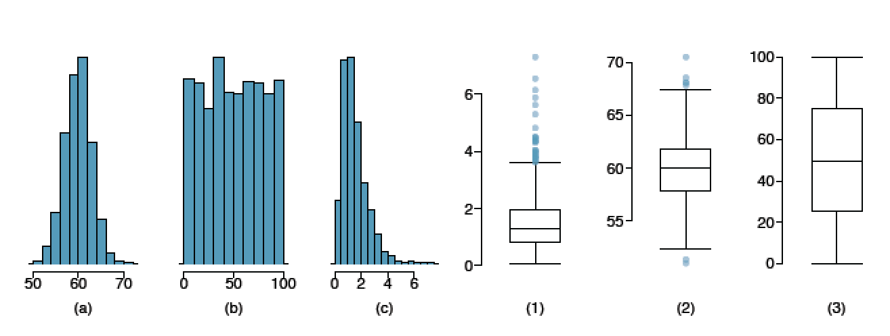
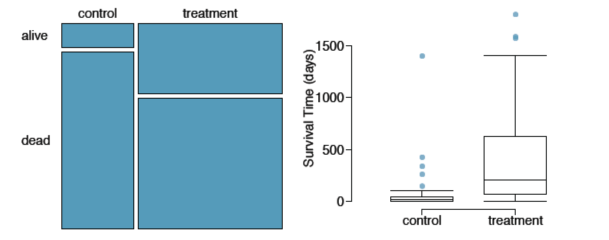
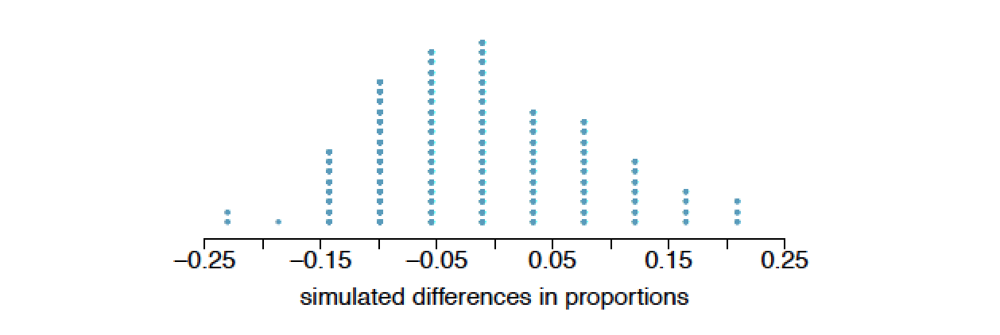

```{r setup, include=FALSE}
knitr::opts_chunk$set(echo = TRUE)
```

## Graded
#### 1.8 Smoking habits of UK residents

A survey was conducted to study the smoking habits of UK residents. Below is a data matrix displaying a portion of the data collected in this survey. Note that “£” stands for British Pounds Sterling, “cig” stands for cigarettes, and “N/A” refers to a missing component of the data.

```{r, warning=FALSE, message=FALSE}
if (!require("openintro")) install.packages('openintro')
data(smoking)
str(smoking)

#(a) What does each row of the data matrix represent?
# an observation/row represents a survey response

#(b) How many participants were included in the survey?
# 1691

#(c) Indicate whether each variable in the study is numerical or categorical.
# If numerical, identify as continuous or discrete. If categorical, indicate if
# the variable is ordinal.

# gender <- categorical, nominal
# age <- numerical, discrete
# martialStatus <- categorical, nominal
# highestQualification <- categorical, nominal
# nationality <- categorical, nominal
# ethnicity <- categorical, nominal
# grossIncome <- categorical, ordinal
# region <- categorical, nominal
# smoke <- categorical, nominal
# amtWeekends <- numerical, discrete
# amtWeekdays <- numerical, discrete
# type <- categorical, nominal
```

#### 1.10 Cheaters, scope of inference 

Exercise 1.5 introduces a study where researchers studying the relationship between honesty, age, and self-control conducted an experiment on 160 children between the ages of 5 and 15. The researchers asked each child to toss a fair coin in private and to record the outcome (white or black) on a paper sheet, and said they would only reward children who report white. Half the students were explicitly told not to cheat and the others were not given any explicit instructions. Differences were observed in the cheating rates in the instruction and no instruction groups, as well as some differences across children’s characteristics within each group.

(a) Identify the population of interest and the sample in this study.
(b) Comment on whether or not the results of the study can be generalized to the population, and if the findings of the study can be used to establish causal relationships.

```{r}
# a) The population of interest is children between the ages of 5 and 15.   
# The sample is 160 children in that age range.  
# b) While this is an interesting study, it would be difficult to generalize to
# the target population without taking a few steps.   It is noted that the 
# children were split into two groups but it doesn't say that this split was
# done randomly.   We don't know anything about the sampling method for finding
# these 160 children.   Blocking would likely be an effective technique, as
# surely a child aged 5 has a very different level of social intelligence than
# a child of 15.   We would also want a certain level of replication (whether
# through a larger sample or a repeated experiment).  Without more of these
# principles considered, it would be difficult to generalize.  Since the design
# of the study is experimental, it could be used to assume causal
# relationships. 
```

#### 1.28 Reading the paper

(a) An article titled Risks: Smokers Found More Prone to Dementia states the following:

“Researchers analyzed data from 23,123 health plan members who participated in a voluntary exam and health behavior survey from 1978 to 1985, when they were 50-60 years old. 23 years later, about 25% of the group had dementia, including 1,136 with Alzheimer’s disease and 416 with vascular dementia. After adjusting for other factors, the researchers concluded that pack-aday smokers were 37% more likely than nonsmokers to develop dementia, and the risks went up with increased smoking; 44% for one to two packs a day; and twice the risk for more than two packs.”

Based on this study, can we conclude that smoking causes dementia later in life? Explain your reasoning.

```{r}
# Since this is an observational study consisting of an exam and survey, we
# cannot attribute causation.   
```

(b) Another article titled The School Bully Is Sleepy states the following:

“The University of Michigan study, collected survey data from parents on each child’s sleep habits and asked both parents and teachers to assess behavioral concerns. About a third of the students studied were identified by parents or teachers as having problems with disruptive behavior or bullying. The researchers found that children who had behavioral issues and those who were identified as bullies were twice as likely to have shown symptoms of sleep disorders.”

A friend of yours who read the article says, “The study shows that sleep disorders lead to bullying in school children.” Is this statement justified? If not, how best can you describe the conclusion that can be drawn from this study?

```{r}
# Again since this is an observational study it shows evidence of a
# relationship between sleep and bullying, but it cannot imply causation.  
```

#### 1.36 Exercise and mental health

A researcher is interested in the effects of exercise on mental health and he proposes the following study: Use stratified random sampling to ensure representative proportions of 18-30, 31-40 and 41- 55 year olds from the population. Next, randomly assign half the subjects from each age group to exercise twice a week, and instruct the rest not to exercise. Conduct a mental health exam at the beginning and at the end of the study, and compare the results.

(a) What type of study is this?
(b) What are the treatment and control groups in this study?
(c) Does this study make use of blocking? If so, what is the blocking variable?
(d) Does this study make use of blinding?
(e) Comment on whether or not the results of the study can be used to establish a causal relationship between exercise and mental health, and indicate whether or not the conclusions can be generalized to the population at large.
(f) Suppose you are given the task of determining if this proposed study should get funding. Would you have any reservations about the study proposal?

```{r}
# a) Experimental
# b) Treatment: exercise twice a week; Control:  Do note exercise
# c) Yes - age group. 
# d) No
# e) Since this is an experiment, a causal relationship can be inferred from
# the outcome.   It would appear that good experimental design was used.   So
# long as the sample is sufficiently large and the sampling techniques ensured
# the sample is representative of the population, the results should be
# generalizeable. 
# f) I would suggest that 2 times a week is not sufficient exercise to
# determine a link to mental health.   If this number were increased to 4 or 5,
# perhaps.   Exercise also comes in many forms.   It would be difficult to
# ensure that those in the control group did not get exercise in such a way as
# to potentially impact their mental health.
```

#### 1.48 Stats scores

```{r}
scores <- c(57, 66, 69, 71, 72, 73, 74, 77, 78, 78, 79, 79, 81, 81, 82, 83, 83, 88, 89, 94)
## Create a box plot of the distribution of these scores.
boxplot(scores, main="Exam Score Distribution for 20 Intro Stats Students")
```

#### 1.50 Mix-and-match 

Describe the distribution in the histograms below and match them to
the box plots.



```{r}
# a:2, unimodal, symmetric
# b:3, multimodal, symmetric
# c:1, unimodal, skewed right
```

#### 1.56 Distributions and appropriate statistics, Part II 

For each of the following, state whether you expect the distribution to be symmetric, right skewed, or left skewed. Also specify whether the mean or median would best represent a typical observation in the data, and whether the variability of observations would be best represented using the standard deviation or IQR.  Explain your reasoning.

(a) Housing prices in a country where 25% of the houses cost below $350,000, 50% of the houses cost below $450,000, 75% of the houses cost below $1,000,000 and there are a meaningful number of houses that cost more than $6,000,000.

```{r}
# Distribution would be right skewed.   Median would be a better
# representation, and IQR would show where the majority of the data resides.
# Since 75% of the houses < $1 mil, but a "meaningful number" are > $6 mil,
# these outliers would throw off mean and sd observations. 
```

(b) Housing prices in a country where 25% of the houses cost below $300,000, 50% of the houses cost below $600,000, 75% of the houses cost below $900,000 and very few houses that cost more than $1,200,000.

```{r}
# Distribution:  symmetric.   Since there are few outliers, mean and SD should
# be robust enough.   
```

(c) Number of alcoholic drinks consumed by college students in a given week. Assume that most of these students don’t drink since they are under 21 years old, and only a few drink excessively.

```{r}
# Since there is a baseline of 0 drinks and some will drink excessively, the
# data will be skewed right.   Median and IQR will be the best measures of
# variability. 
```

(d) Annual salaries of the employees at a Fortune 500 company where only a few high level executives earn much higher salaries than the all other employees.

```{r}
# This is likely to be skewed right with a baseline > than 0.  The difference
# between middle of the distribution and the executives with the highest
# salaries will be much greater than the middle of the distribution and the
# employees with the lowest salaries.   Therefore, Median and IQR will be the
# most robust measures of variability.
```

#### 1.70 Heart transplants

The Stanford University Heart Transplant Study was conducted to determine whether an experimental heart transplant program increased lifespan. Each patient entering the program was designated an official heart transplant candidate, meaning that he was gravely ill and would most likely benefit from a new heart. Some patients got a transplant and some did not. The variable transplant indicates which group the patients were in; patients in the treatment group got a transplant and those in the control group did not. Another variable called survived was used to indicate whether or not the patient was alive at the end of the study. 



(a) Based on the mosaic plot, is survival independent of whether or not the patient got a transplant?  Explain your reasoning.

```{r}
# The mosaic plot indicates that a greater proportion of the treatment group
# survived than the control group.  This suggests a dependant relationship
# between the transplant and survival. 
```

(b) What do the box plots below suggest about the efficacy (effectiveness) of the heart transplant treatment.

```{r}
# The median of the treatment group is nearly 1 year while the control group is
# very very low.   Even the Q1 of the treatment group is higher than the Q3 of
# the control group, nevermind how much higher Q3 of the treatment group is.
# The boxplots suggest that the transplant treatment is effective at buying the
# patient additional time.
```

(c) What proportion of patients in the treatment group and what proportion of patients in the control group died?

```{r}
# Based on the mosaic plot, ~ 6/7 of the control group died as compared to 3/5
# of the treatment group.
```

(d) One approach for investigating whether or not the treatment is effective is to use a randomization technique.
    i. What are the claims being tested?  __H~0~:  Having a stent and survival are independant.  Any relationship is due to chance. H~A~:  Having a stent and survival are dependant.  Any increase in survival rates is due to the stent treatment.__
    ii. The paragraph below describes the set up for such approach, if we were to do it without using statistical software. Fill in the blanks with a number or phrase, whichever is appropriate.
        + We write alive on cards __equivalent to the number of people in 1/7 of the control group and 2/5 of the treatment group__ representing patients who were alive at the end of the study, and dead on cards __equivalent to the number of people in 6/7 of the control group and 3/5 of the treatment group__ representing patients who were not. Then, we shuffle these cards and split them into two groups: one group of a size __equivalent to the original treatment group__ representing treatment, and another group of a size __equivalent to the original control group__ representing control. We calculate the difference between the proportion of dead cards in the treatment and control groups (treatment - control) and record this value. We repeat this 100 times to build a distribution centered at __0__. Lastly, we calculate the fraction of simulations where the simulated differences in proportions are __greater than 2/5 - 1/7 or 9/35 (roughly 0.257)__. If this fraction is low, we conclude that it is unlikely to have observed such an outcome by chance and that the null hypothesis should be rejected in favor of the alternative.
    iii. What do the simulation results shown below suggest about the effectiveness of the transplant program?



```{r}
# We can see from the simulation results above that the difference in our
# original proportion (roughly 0.257) is very unique, suggesting that this did
# not occur by chance.   We can reject the null hypothesis, as there is strong
# evidence that the experimental heart transplant does increase lifespan.   
```
